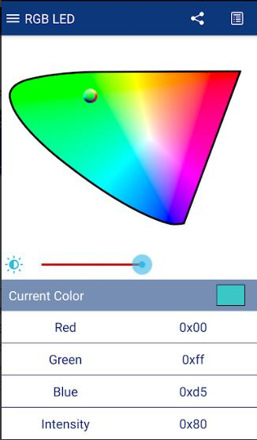
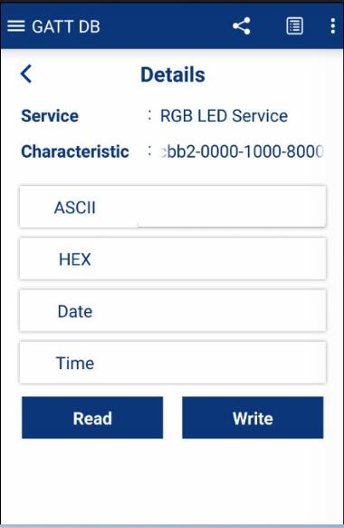

# TTGO Simple BLE RGB Control  

The project needs to rely on the following libraries:
- [Adafruit_NeoPixel](https://github.com/adafruit/Adafruit_NeoPixel)

# How to use ?
- Default RGB DIO uses `13` Pin (Picture right upper jack)
- Dowload [CySmart Andriod](https://play.google.com/store/apps/details?id=com.cypress.cysmart&hl=en) ,if you use IOS,you can search APP Store.
- Open CySmart connect `TTGI-RGB` device,cilck `RGB LED Service` ,you can adjust the color palette to change colors.
  
  

- You can change RGB blink mode , Follow the steps below to make changes:
- In main page , `GATT DB` -> `RGB LED Service` -> select `0000cbb2` Characteristics ->`HEX` -> `Write` -> `0x00~0x07`
  
  

# Important:
If too many Pixels will trigger a low voltage detector, ESP32 will automatically reset. If you need to connect a lot of Pixels, you should provide a stable power supply.

